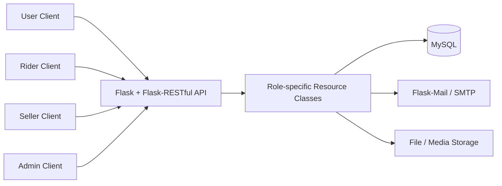
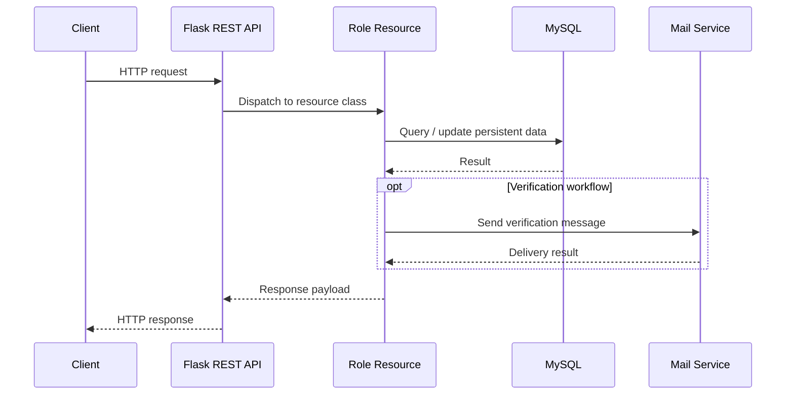

<div align="center">

# Flask Takeout Service Backend
### Multi-Role REST API Prototype for Users, Riders, Sellers, and Administrators


</div>

## Overview

This repository contains an early **Flask-based takeout / marketplace backend** built around several application roles: end users, delivery riders, sellers, and administrators. It provides REST-style endpoints for account management, email-assisted workflows, ordering, search, social interactions, file uploads, rider tasks, income queries, and administrative operations.

The project is organized as a lightweight service layer rather than a monolithic `app.py`: route registration lives in the Flask entry point while role-specific behavior is separated into modules under `models/`.

## Architecture



## Repository Structure

```text
flaskProject/
├── app.py                  # Flask application and route registration
├── my_mail.py              # Environment-backed mail configuration
├── models/
│   ├── user.py             # User account/order/search/upload resources
│   ├── rider.py            # Rider login/task/income resources
│   ├── seller.py           # Seller interactions and uploads
│   ├── admin.py            # Administrative operations
│   └── mysql.py            # MySQL connection configuration
├── templates/
│   └── upload.html         # Upload-related template
└── README.md
```

## API Map

### User APIs

| Endpoint | Purpose |
| --- | --- |
| `POST /user/login` | User login |
| `POST /user/register` | Registration workflow |
| `/user/cancellation` | Account cancellation |
| `/user/changePassword` | Change account password |
| `/user/changeName` | Update display name |
| `/user/follow` | Follow operation |
| `/user/order` | Place/manage an order |
| `/user/searchBySeller` | Search by seller |
| `/user/searchByGoods` | Search by goods |
| `/user/searchByClassfication` | Search by category/classification |
| `/user/upload_user` | Upload user-side media/profile data |
| `/mail` | Mail-related verification/service endpoint |

### Rider APIs

| Endpoint | Purpose |
| --- | --- |
| `/rider/login` | Rider login |
| `/rider/task` | Rider task / order acceptance workflow |
| `/rider/income` | Query rider income |

### Seller APIs

| Endpoint | Purpose |
| --- | --- |
| `/seller/like` | Like interaction |
| `/seller/collection` | Favorite / collection interaction |
| `/seller/forward` | Forward/share interaction |
| `/seller/comment` | Comment interaction |
| `/seller/upload_seller` | Upload seller/product information |

### Administration

| Endpoint | Purpose |
| --- | --- |
| `/admin/user` | Administrative user operations |

## Request Flow



## Technology Stack

The codebase uses a compact Python web stack:

- **Flask** — web application framework;
- **Flask-RESTful** — resource-oriented route registration;
- **PyMySQL** — MySQL access;
- **Flask-Mail** — email delivery / verification support;
- HTML templates for upload-related flows.

## Configuration

The current version no longer stores development credentials directly in source files. Configure the database through environment variables:

```bash
export TAKEOUT_DB_HOST="localhost"
export TAKEOUT_DB_PORT="3306"
export TAKEOUT_DB_USER="root"
export TAKEOUT_DB_PASSWORD="<your-db-password>"
export TAKEOUT_DB_NAME="west2_takeout"
```

For mail support:

```bash
export MAIL_SERVER="smtp.example.com"
export MAIL_PORT="465"
export MAIL_USE_SSL="true"
export MAIL_USERNAME="<your-mail-account>"
export MAIL_PASSWORD="<your-mail-app-password>"
export MAIL_DEFAULT_SENDER="<your-mail-account>"
```

> Historical versions of this repository contained development credentials in committed source files. Those values have been removed from the current code. Any credential previously committed should be treated as exposed and rotated/revoked at the corresponding provider.

## Running

Install the required Python packages in a virtual environment, for example:

```bash
python -m venv .venv
source .venv/bin/activate
pip install flask flask-restful flask-mail pymysql
```

Then ensure MySQL and any required tables are available and run:

```bash
python app.py
```

Flask uses its default development server configuration unless changed in `app.py`.

## Design Notes

The repository reflects an early service-development exercise. A production version would normally add schema migrations, explicit request/response validation, password hashing/authentication tokens, ORM or transaction abstractions, structured logging, automated tests, file-storage isolation, and deployment configuration. The current project is intentionally preserved close to the original implementation while its documentation and secret handling have been modernized.

## Portfolio Context

This project demonstrates early experience with **role-based API design, relational persistence, email integration, ordering workflows, and modular Python backend development**.

## Author

**Bo Liu**  
Contact: `liubo317@hnu.edu.cn`  
Homepage: https://boliupro.github.io
